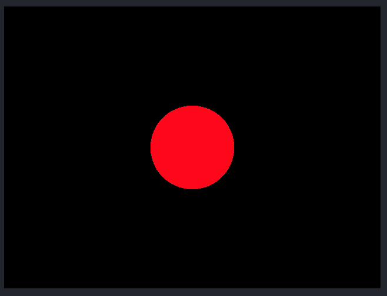
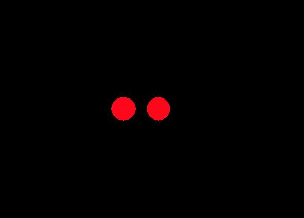
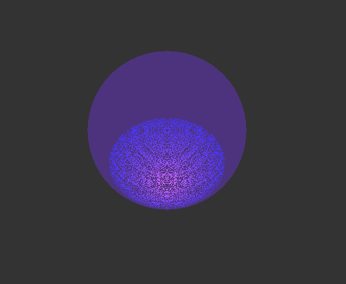
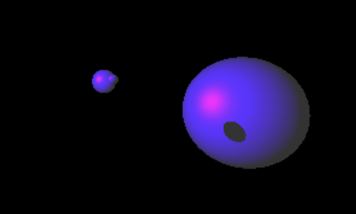
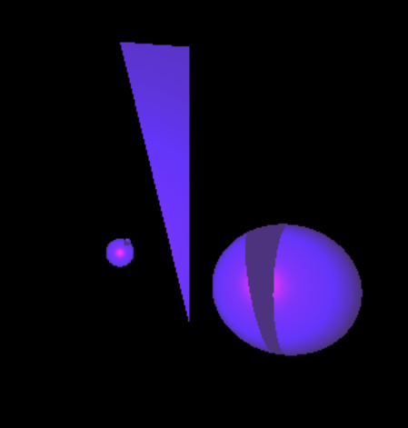

# Raytracer - Ongoing Project

### Description
Renders scenes using the Phong Illumination model, linear transforms, multiple lights, written in C++.
### Evolution of Raytracer
#### Rendering of Sphere Primitive

#### Rendering Two Spheres

#### Rendering of Sphere Primitive, Introduction of Lighting

#### Rendering of Sphere Primitive, Lighting Improvements

#### Rendering of Sphere Primitive, Point Light Source Lighting Resolved

#### Rendering of Sphere Primitive, Specular Component of Materials Implemented

#### Rendering Three Spheres, One Point Light Source

#### Rendering Three Spheres, Shadows Implemented

#### Rendering Spheres and Triangle, Shadows Implemented

#### Rendering A More Complex Scene, Desk, Each Primitive Assigned A Color, No Lighting

